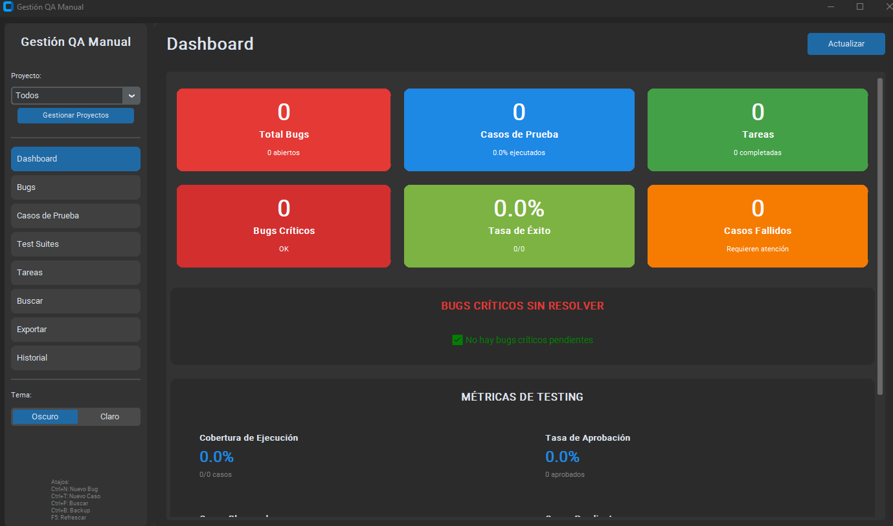
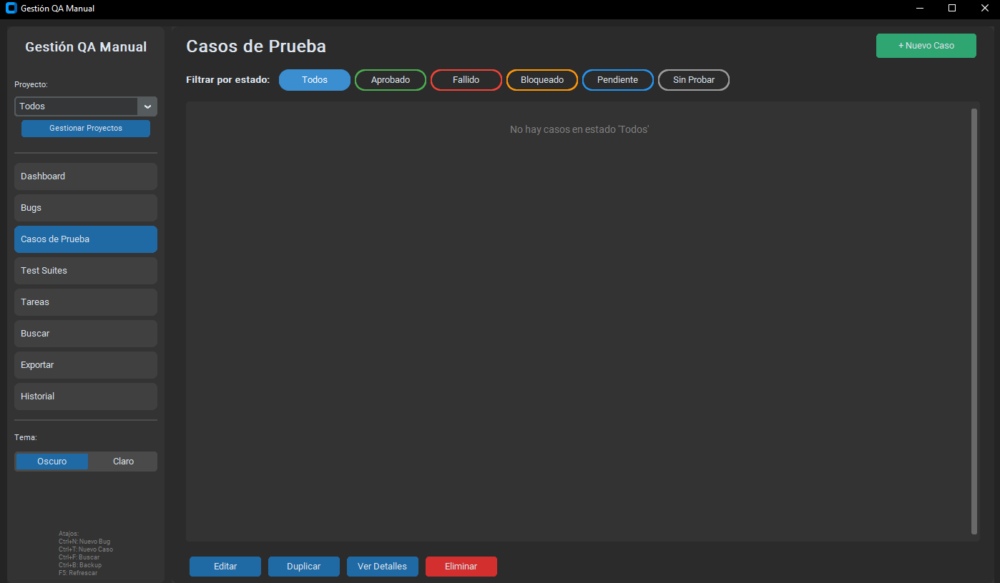
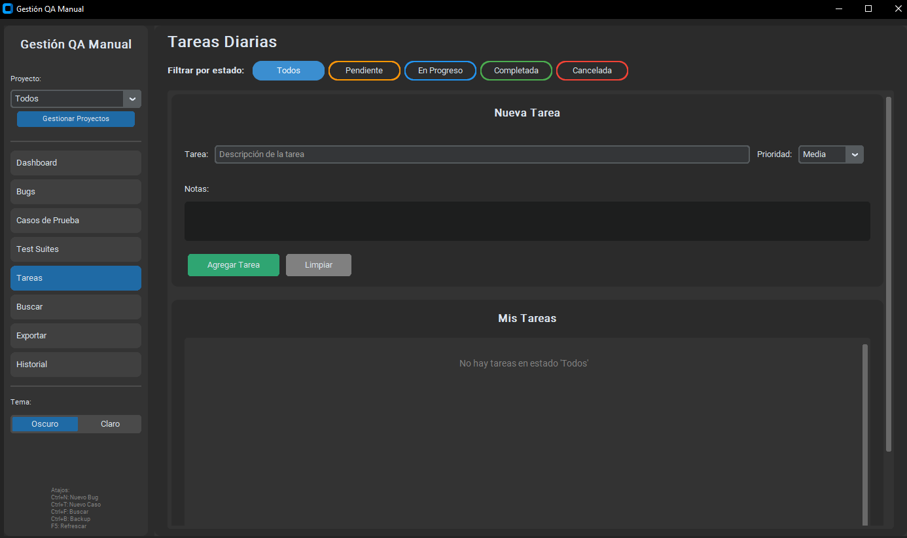
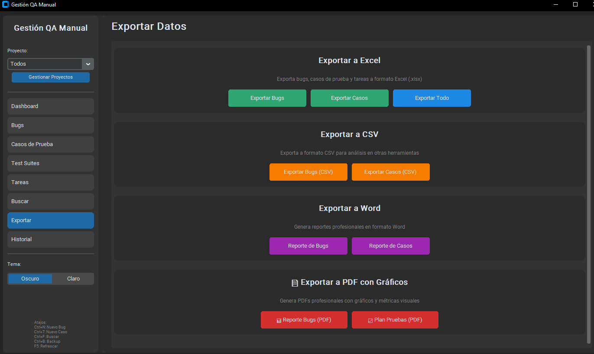

# QA Manager - Gestión de Testing Manual

Una aplicación de escritorio que creé para gestionar todo el ciclo de testing manual de forma profesional y gratuita.

## ¿Por qué creé esto?
Creado para facilitar la gestión de testing manual en proyectos pequeños, ofreciendo una solución simple, profesional y completamente offline para administrar bugs y casos de prueba.

## Capturas de Pantalla

<p align="center">
  
  &nbsp;&nbsp;
  
</p>
<p align="center">
  
  &nbsp;&nbsp;
  
</p>

## Características Principales
### Gestión de Bugs
- Ciclo completo: Nuevo → En Progreso → Resuelto → Cerrado
- Severidad y prioridad configurables
- **Múltiples capturas de pantalla** por bug (sin límite)
- Pasos de reproducción detallados
- Organización por proyectos

### Casos de Prueba
- Documentación completa con precondiciones, pasos y resultados esperados
- **10 plantillas predefinidas** para casos comunes (Login, APIs, Formularios, etc.)
- Ejecución de pruebas con actualización de estados
- Creación de suites para testing por lotes
- Tipos: Funcional, Regresión, Integración, Smoke, Performance

### Reportes Profesionales
- **Exportación a PDF con gráficos** 
- Excel con formato y colores
- Word para documentación
- CSV para análisis de datos

### Multi-Proyecto
- Gestiona varios clientes/proyectos simultáneamente
- Filtros por proyecto en todas las vistas
- Perfecto para freelancers

### Otras Características
- Dashboard con métricas en tiempo real
- Búsqueda global en todo
- Respaldos automáticos cada 30 minutos
- Temas oscuro y claro
- Atajos de teclado para todo

## Instalación
### Requisitos
- Python 3.8 o superior
- Windows, macOS o Linux

### Instalar

```bash
# Instalar dependencias
pip install customtkinter openpyxl python-docx reportlab

# Ejecutar
python qa_manager.py
```

Eso es todo. Sin registro, sin configuración complicada.

## Uso Rápido

```bash
Ctrl+N  →  Nuevo Bug
Ctrl+T  →  Nuevo Caso de Prueba
Ctrl+F  →  Buscar en todo
Ctrl+B  →  Respaldo manual
F5      →  Refrescar vista
```

## Donde quedan mis datos?
Todo se guarda localmente en la carpeta `qa_data/`:

```
qa_data/
├── bugs.json              # Tus bugs
├── test_cases.json        # Tus casos de prueba
├── screenshots/           # Imágenes adjuntas
├── exports/               # Reportes generados
└── backups/               # Respaldos automáticos
```

**Ventaja:** Puedes copiar esta carpeta a cualquier computadora y todos tus datos van contigo.

## Casos de uso pensado: 
**Para Freelancers:**
- Gestiona 3, 5, 10 proyectos de clientes sin pagar nada
- Genera reportes profesionales para entregar
- Tus datos son 100% tuyos

**Para Estudiantes:**
- Construye tu portafolio de testing
- Practica workflows profesionales
- Demuestra experiencia en entrevistas

**Para Equipos Pequeños:**
- Alternativa gratuita a herramientas de $500/año
- Sin límites de usuarios
- Sin dependencia de internet


## Contribuciones
Si encuentras bugs o tienes ideas para mejoras, abre un issue. Pull requests son bienvenidos.

## Licencia
MIT - Úsalo como quieras, personal o comercial.

## Soporte
¿Problemas? ¿Preguntas? Abre un issue en GitHub.

---

**Nota:** Esta herramienta la construí para resolver mis propias necesidades como tester QA. La comparto esperando que te sea útil también.
